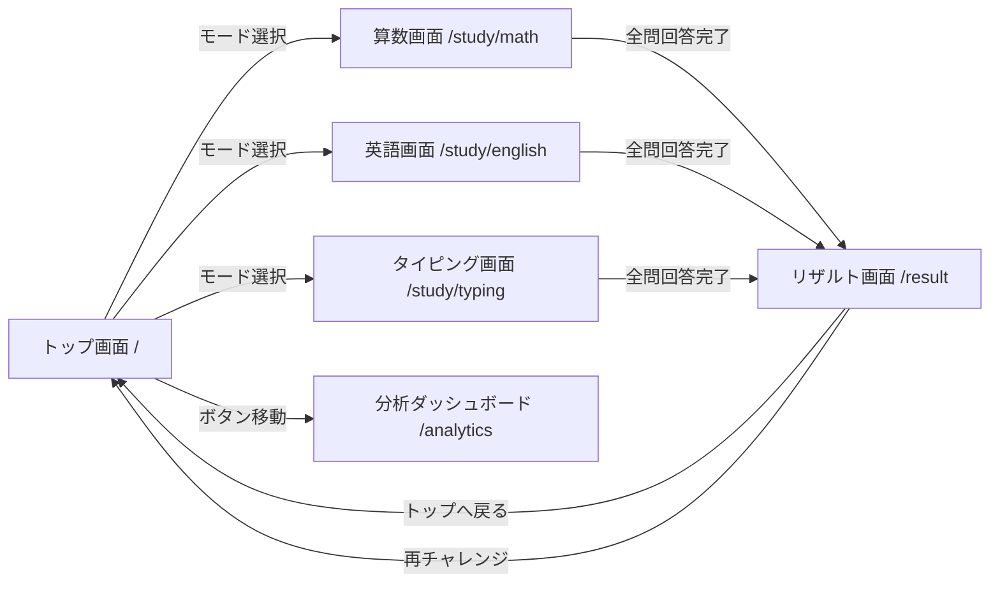

# 基本設計書 (Basic Architecture & System Design)

## 1. システム全体概要・アーキテクチャ

本アプリケーションは、Raspberry Pi 4 上で動作する Node.js (Express) バックエンド Web サーバーと、Vite + React + TypeScript + Tailwind CSS で構築されるシングルページアプリケーション（SPA）フロントエンド、および SQLite3 データベースで構成される。

### 1.1 全体構成図

```mermaid
graph TD
    Client[ブラウザ (PC/タブレット/Pi画面)] -->|HTTP GET / static| Express[Express Web Server (Node.js)]
    Client -->|REST API (JSON)| Express
    Express -->|dist/ 配信| StaticFiles[React Build Assets]
    Express -->|SQL Query| SQLite[(SQLite3: kids_app.db)]
```

### 1.2 技術スタック指定
* **フロントエンド**: React 19, TypeScript, Vite 6, Tailwind CSS v4, Lucide-React (アイコン)
* **バックエンド**: Node.js (v24 LTS), Express 4, `better-sqlite3` (同期・高速SQLiteドライバ)
* **開発言語**: TypeScript (全レイヤー型統一)

---

## 2. ディレクトリ構造・ソースコード構成

プロジェクトルートディレクトリの構成は以下の通りとする。

```
apps_for_kid/
├── docs/                        # ドキュメント類
├── public/                      # 静的アセット (音声・効果音ファイル等)
├── src/                         # フロントエンドソースコード (React)
│   ├── assets/                  # 画像・SVG等
│   ├── components/              # 共通UIコンポーネント
│   │   ├── common/              # Button, Card, Header, Modal等
│   │   └── ui/                  # レンダリング補助コンポーネント
│   ├── pages/                   # 各画面ページコンポーネント
│   │   ├── TopPage.tsx          # メニュー・ダッシュボード
│   │   ├── MathPage.tsx         # 算数学習画面
│   │   ├── EnglishPage.tsx      # 英語学習画面
│   │   ├── TypingPage.tsx       # タイピング学習画面
│   │   ├── ResultPage.tsx       # リザルト・スコア画面
│   │   └── AnalyticsPage.tsx    # 得意・苦手分析画面
│   ├── services/                # バックエンド通信 API クライアント (`apiClient.ts`)
│   ├── utils/                   # 共通計算ロジック
│   │   ├── mathGenerator.ts     # 算数問題自動生成ロジック
│   │   └── typingCalculator.ts  # WPM・正確性計算ロジック
│   ├── types/                   # フロントエンド共有型定義 (`index.ts`)
│   ├── App.tsx                  # ルーティング・全体レイアウト
│   ├── main.tsx                 # エントリーポイント
│   └── index.css                # Tailwind CSS インポート
├── server/                      # バックエンドソースコード (Node.js Express)
│   ├── index.ts                 # サーバーエントリーポイント・Express設定
│   ├── db.ts                    # SQLite 接続・初期化 (better-sqlite3)
│   ├── routes/                  # API ルーティング
│   │   ├── sessions.ts          # /api/sessions エンドポイント
│   │   └── analytics.ts         # /api/analytics エンドポイント
│   └── repositories/            # DBデータアクセス層 (DAO)
│       └── sessionRepository.ts
├── package.json
├── tsconfig.json
├── vite.config.ts
└── tailwind.config.js
```

---

## 3. 画面設計・コンポーネント構成仕様

### 3.1 画面遷移図



### 3.2 各画面詳細仕様

#### 1. トップ画面 (`TopPage.tsx`)
* **構成要素**:
  * ヘッダー: タイトルロゴ、本日の日付、連続学習日数（ストリークアイコン）
  * テーマ選択カード (3つ):
    * 算数（足し算/引き算/掛け算/逆算）
    * 英語（基礎単語/リスニング）
    * タイピング（英単語/英文）
  * 分析ダッシュボード遷移ボタン
* **State**: 今日の学習セッション数、ストリーク日数

#### 2. 算数学習画面 (`MathPage.tsx`)
* **構成要素**:
  * プログレスバー (例: 1/10問)
  * 出題表示エリア（大きな数字・フォント）
  * 解答入力テンキー (0〜9、一文字消去、決定ボタン)
  * タイマーカウントダウン（タイムアタック時）
* **ロジック**: `mathGenerator.ts` により難易度/問題タイプに応じた問題を動的生成。
* **State**: 現在の問題インデックス、スコア、経過時間、問題ログ配列 (`details`)

#### 3. タイピング学習画面 (`TypingPage.tsx`)
* **構成要素**:
  * 出題英単語/英文表示（入力済み文字: 緑、現在文字: 強調ハイライト、未入力: 灰色）
  * リアルタイムWPM・正確性(%)表示
  * 視覚的オンスクリーンキーボードガイド
* **キーボードイベント**: `window.addEventListener('keydown')` で入力検知。バックスペース無効化または正確性計算に組み込み。

#### 4. リザルト画面 (`ResultPage.tsx`)
* **構成要素**:
  * スコア・正答率・所要時間・WPMのカード表示
  * 成績評価コメント（「すばらしい！」「あとすこし！」等）
  * 今回獲得したバッジのPOP表示
  * 「もういちど」「トップへ戻る」ボタン
* **処理**: 画面描画時に `POST /api/sessions` を実行し、SQLiteに保存。

#### 5. 得意・苦手分析ダッシュボード (`AnalyticsPage.tsx`)
* **構成要素**:
  * 過去のスコア・WPM推移（SVGラインチャート / ドットチャート）
  * 得意なテーマ・苦手な問題パターンのハイライト（例: 「繰り下がり引き算の正確性: 68% (要復習)」）
  * 弱点克服リベンジモード開始ボタン

---

## 4. データ構造 & TypeScript 型定義 (`src/types/index.ts`)

```typescript
// 学習テーマ定義
export type SubjectType = 'math' | 'english' | 'typing';

// 算数の問題タイプ
export type MathMode = 
  | 'addition_carry'      // 繰り上がり足し算 (2〜4桁)
  | 'subtraction_borrow'  // 繰り下がり引き算 (2〜4桁)
  | 'multiplication_12x12'// 1x1〜12x12
  | 'match_target_12'     // 答えが12になる式選択
  | 'equation_solve';     // 逆算 (x * 3 = 6)

// 問題1問の共通インターフェース
export interface Question {
  id: string;
  questionText: string;     // 画面表示文言 (例: "348 + 574 = ?")
  correctAnswer: string;    // 正解文字 (例: "922")
  options?: string[];       // 選択肢問題の場合の選択肢配列
  hint?: string;            // ヒント文言
}

// ユーザーの1問解答ログ
export interface QuestionResultDetail {
  questionText: string;
  userAnswer: string;
  correctAnswer: string;
  isCorrect: boolean;
  responseTimeMs: number;
}

// セッション保存リクエストペイロード
export interface CreateSessionPayload {
  userId: number;
  subject: SubjectType;
  mode: string;
  score: number;
  totalQuestions: number;
  correctCount: number;
  accuracy: number;
  wpm?: number;
  durationSeconds: number;
  details: QuestionResultDetail[];
}

// 分析ダッシュボードデータ構造
export interface AnalyticsSummary {
  userId: number;
  totalSessions: number;
  totalDurationMinutes: number;
  streakDays: number;
  subjects: {
    [key in SubjectType]?: {
      sessionsCount: number;
      avgAccuracy: number;
      avgWpm?: number;
      weakTopics: string[];
    }
  };
  scoreHistory: Array<{
    date: string;
    score: number;
    wpm?: number;
  }>;
}
```

---

## 5. バックエンド設計 & API 仕様 (Express & SQLite)

### 5.1 SQLite リポジトリ設計 (`server/repositories/sessionRepository.ts`)

```typescript
import db from '../db';
import { CreateSessionPayload, AnalyticsSummary } from '../../src/types';

export class SessionRepository {
  // セッションと明細の一括登録 (トランザクション処理)
  static createSession(payload: CreateSessionPayload): { sessionId: number } {
    const insertSession = db.prepare(`
      INSERT INTO learning_sessions 
      (user_id, subject, mode, score, total_questions, correct_count, accuracy, wpm, duration_seconds)
      VALUES (?, ?, ?, ?, ?, ?, ?, ?, ?)
    `);

    const insertDetail = db.prepare(`
      INSERT INTO quiz_results 
      (session_id, question_text, user_answer, correct_answer, is_correct, response_time_ms)
      VALUES (?, ?, ?, ?, ?, ?)
    `);

    // トランザクションで保存
    const runTransaction = db.transaction(() => {
      const info = insertSession.run(
        payload.userId,
        payload.subject,
        payload.mode,
        payload.score,
        payload.totalQuestions,
        payload.correctCount,
        payload.accuracy,
        payload.wpm ?? null,
        payload.durationSeconds
      );
      const sessionId = info.lastInsertRowid as number;

      for (const d of payload.details) {
        insertDetail.run(
          sessionId,
          d.questionText,
          d.userAnswer,
          d.correctAnswer,
          d.isCorrect ? 1 : 0,
          d.responseTimeMs
        );
      }
      return sessionId;
    });

    const sessionId = runTransaction();
    return { sessionId };
  }

  // 分析サマリーの計算・取得
  static getAnalyticsSummary(userId: number): AnalyticsSummary {
    const totalRow = db.prepare(`
      SELECT COUNT(*) as totalSessions, SUM(duration_seconds) as totalSec 
      FROM learning_sessions WHERE user_id = ?
    `).get(userId) as any;

    const historyRows = db.prepare(`
      SELECT DATE(created_at) as date, AVG(score) as score, AVG(wpm) as wpm 
      FROM learning_sessions WHERE user_id = ? 
      GROUP BY DATE(created_at) ORDER BY date DESC LIMIT 7
    `).all(userId) as any[];

    return {
      userId,
      totalSessions: totalRow.totalSessions || 0,
      totalDurationMinutes: Math.round((totalRow.totalSec || 0) / 60),
      streakDays: 1, // ストリーク算出ロジック
      subjects: {},
      scoreHistory: historyRows.map(r => ({ date: r.date, score: Math.round(r.score), wpm: r.wpm ? Math.round(r.wpm) : undefined }))
    };
  }
}
```

---

## 6. コアアルゴリズム仕様

### 6.1 算数問題自動生成アルゴリズム (`src/utils/mathGenerator.ts`)

1. **繰り上がり足し算 (`addition_carry`)**:
   * 2桁〜4桁の整数 $A, B$ を乱数生成。
   * 一の位、十の位等の少なくとも1箇所で $A_i + B_i \ge 10$ になるよう制御。
2. **繰り下がり引き算 (`subtraction_borrow`)**:
   * $A > B$ となる2〜4桁の数値を生成。
   * $A_i < B_i$ となる桁を含ませ、繰り下がりが発生することを保証。
3. **12×12 九九 (`multiplication_12x12`)**:
   * $1 \le a, b \le 12$ の範囲でランダムに生成。問題テキストは `a × b = ?`。
4. **答えが12になる掛け算の選択 (`match_target_12`)**:
   * 正解の組み合わせ: `(1×12, 2×6, 3×4, 4×3, 6×2, 12×1)`
   * 不正解の選択肢ダミー: `(2×5, 3×5, 4×4, 2×7)` 等から選出。
5. **逆算問題 (`equation_solve`)**:
   * `x * a = c` または `a * x = c` (例: `x × 3 = 6` 提案)。
   * 変数 `x` の正解数値を 1〜12 の範囲でランダム設定し、式を組み立てる。

---

## 7. 実装・検証手順（中堅エンジニア向けガイド）

1. **ステップ1: プロジェクトのセットアップ**
   ```bash
   npm create vite@latest ./ -- --template react-ts
   npm install tailwindcss @tailwindcss/vite express better-sqlite3 lucide-react
   ```
2. **ステップ2: DB初期化モジュール構築**
   * `server/db.ts` を作成し、起動時に `docs/database_schema.md` の DDL を自動実行する処理を作成。
3. **ステップ3: Express サーバーとVite統合**
   * `server/index.ts` で API エンドポイント `/api/*` を登録し、本番用には `dist/` の静的ファイルを `express.static` で配信。
4. **ステップ4: 各学習コンポーネントの実装**
   * `MathPage`, `TypingPage`, `AnalyticsPage` のコンポーネント作成。
5. **ステップ5: Raspberry Pi 4 での動作確認**
   * `npm run build && node server/index.js` でローカルネットワークアクセス動作を検証。
